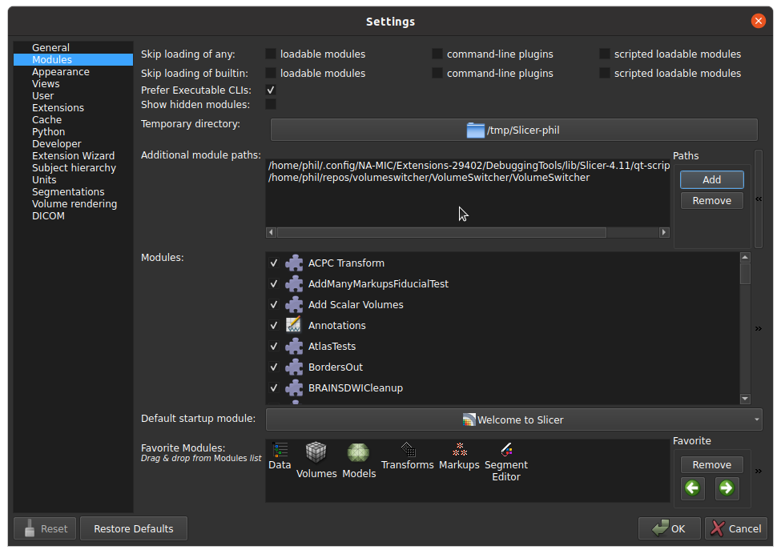
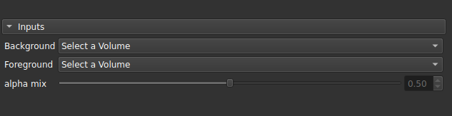

# VolumeSwitcher

Volume Switcher is an open source extension for [3DSlicer](http://www.slicer.org/), lets you switch between volumes in 3D Slicer without losing track of the zoom and 3D position. 
You can easily switch between co-registered volumes to observe the same detail in every view without navigating for the same spot every time you change view.

## Installation

### From GitHub

  

- Download this repo as a .zip archive
- Extract the archive where you want it to reside (the files cannot be moved afterwards in order for VolumeSwitcher to function).
- In 3D Slicer open Edit > Application Settings > Modules
- In Additional Module Paths click on the double-chevron on the right then Add
- Navigate where you extracted the .zip archive and select the VolumeSwitcher sub-directory
- Restart 3D Slicer

- Volume Switcher should now be present in Modules > Utilities

### From the Extension Manager
As for now VolumeSwitcher is only installable from GitHub, we will make it downloadable via the Extension Manager in the future.

## Usage

  

Using VolumeSwitcher is quite straightforward: with Foreground and Background you can select whichever volume you want to be displayed, with the alpha mix slider you can change the alpha blend balance between them.

## Contacts

**Author:**

Filippo Maria Castelli  
castelli@lens.unifi.it  
LENS, European Laboratory for Non-linear Spectroscopy  
Via Nello Carrara 1  
50019 Sesto Fiorentino (FI), Italy
